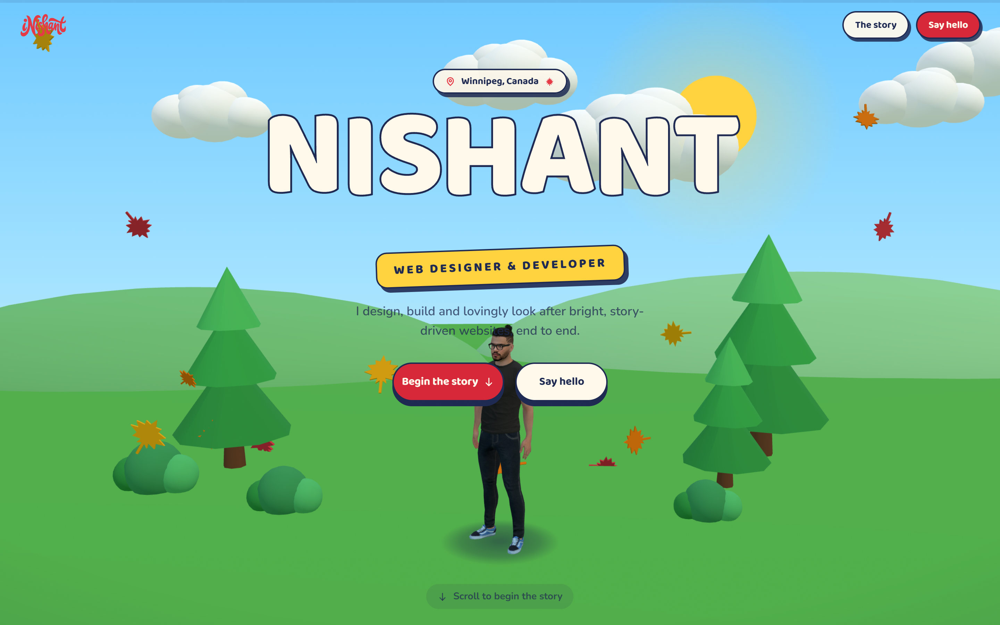

# Pop-Up Storybook — 3D Portfolio

A single-page, scroll-driven **3D portfolio** built as an interactive "pop-up
storybook." One fixed WebGL canvas sits behind the page; as you scroll, paper-toy
scenes rise from the ground, the sky shifts from morning to night, and a character
travels through the story.

<p align="center">
  
</p>

## Features

- 🎬 Single fixed `react-three-fiber` canvas with scroll-driven chapters
- 🪄 Smooth scrolling (Lenis) + GSAP ScrollTrigger scrubbing
- 🔎 Full SEO/GEO layer — JSON-LD structured data, `sitemap.xml`, `robots.txt`,
  dynamic OpenGraph image, and an `llms.txt` for AI answer engines
- ♿ Server-rendered content, semantic HTML, mobile-first responsive design
- ✉️ Contact form with email delivery via Resend

## Tech stack

- **Framework:** Next.js (App Router) + TypeScript
- **Styling:** Tailwind CSS v4 + shadcn/ui
- **3D:** Three.js via react-three-fiber + drei
- **Motion:** GSAP ScrollTrigger, Lenis (smooth scroll)
- **Email:** Resend
- **Hosting:** Vercel

## Getting started

```bash
npm install
npm run dev      # http://localhost:3000
npm run build    # production build
npm run start    # serve the production build
```

## Environment variables

Copy `.env.example` to `.env.local`. The contact form uses Resend:

| Variable | Required | Purpose |
| --- | --- | --- |
| `RESEND_API_KEY` | optional | API key for sending email |
| `CONTACT_TO_EMAIL` | optional | Inbox that receives messages |
| `CONTACT_FROM_EMAIL` | optional | Verified sender address |

Without a key the form still succeeds locally but skips delivery — handy for previews.

## Project structure

```
app/          routes, layout, metadata, sitemap/robots/OG image, contact API
components/   UI sections + three/ (the 3D scene)
lib/          site content + scroll configuration
hooks/        custom React hooks
public/       static assets + 3D model
```

## How it works

- `lib/scroll.ts` is the single source of truth: the DOM section heights and the 3D
  scene windows both derive from one chapter config, so retiming a chapter keeps the
  page and the 3D world in sync.
- Scroll position feeds a small mutable store, smoothed every frame inside the canvas
  — so scrolling never triggers React re-renders.

## Deployment

Deployed on **Vercel**. Pushes to `main` build and deploy automatically.

---

<sub>Built and managed by inishant.com</sub>
